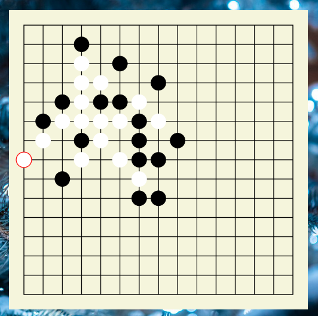

# Project Name
The Gomoku application is a personalized engaging platform that facilitates both PVP 
and AI competition for players to play with the best user experience of this game. 
The customizable interface and setting provide vital Gomoku matching at any moment. 
Furthermore, the app ensures a seamless transition allowing players to take turns 
strategically placing their chess on the board. Be the first to place five in a row 
with no distraction all while enjoying a visually appealing and immersive interface.



# How to run
## 1. With a Release available
* Download the latest binary/zip from the Release section on the right on GitHub.
    * If downloaded a zip, extract the content it to where you want. No password required.
* Run the exe file.  

## 2. With a target folder available on Github
* Download the latest repository on GitHub.
* Move the project-04-gomoku inside the target folder to where you want.
* Run the exe inside the folder.  

## 3. Otherwise 
* Download the latest repository on GitHub.
* Open the folder in an IDE that supports Maven (e.g., IntelliJ).
* On the right panel, click on the Maven icon (m). For Visual Studio Code, it's the maven folder on Explorer.
* Find clean and package operations in the Lifecycle folder. 
* Run ``` clean ``` first, ``` then package ```.
* Run the exe file inside the project-04-gomoku folder in the target directory generated.  

# How to contribute
Follow this project board to know the latest status of the project: [Project Board](https://github.com/orgs/cis3296f23/projects/131])  
Contact the admin for more details.

### How to build
Use this GitHub repository: 
* Download (otherwise fork) the repository from the ``` main ``` branch. Other branches are unstable.
* Use IntelliJ. Any recent version should've worked. If not, try the ``` 2023.2.2 ``` version.
* Specifications
    * Install JavaFX from OpenJFX.
    * Install Scene Kit and other supplementary tools if needed.
    * All installments are automated through Maven. Install them when prompted. There is no need to download anything online manually.
* Running and Testing
    * Run ```executeMain``` to compile and launch the Gomoku program.
* Expectations when running
    * A graphic user interface should show up when running.
    * At first glance, a menu shows up for a user to select operations. It includes the start, exit, and setting buttons. 
    * By clicking on the start, there should be a submenu for the user to select game mode.
        * There should be single-player and multiplayer modes. The multiplayer also contains a sub-selection for Local or WAN versions.
    * Any of the modes would display a game board for the user to place pieces on it. There are also various buttons for pause, restart, and other configurations. 
    * When any player (users/bot/AI) wins, the game would congrats the winner and query for restart. 